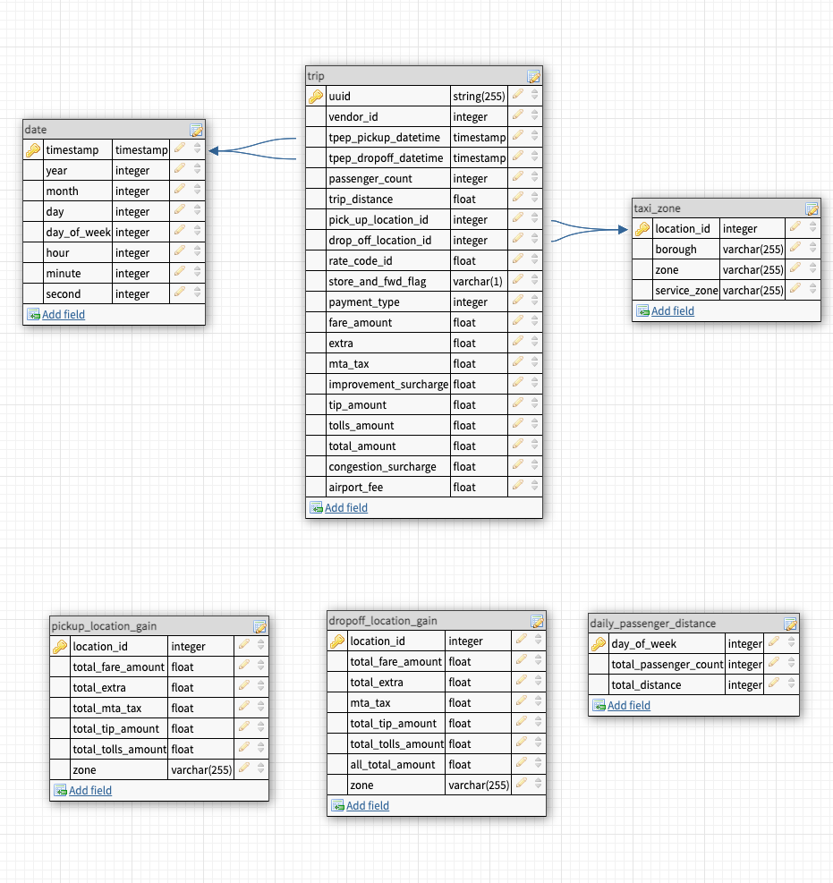

# Udacity data engineering capstone project

## Project purpose

The purpose of this project is to create an ETL pipeline that takes New York city taxi trip, transform the data to different tables and push them to data lakes. The main idea of data partitions are to:

1. Pickup and drop off location for every trip
2. Fare information for each taxi trip
3. Passenger number for each taxi trip parallel with the distance
4. Surchage information for each trip

## Data sources

- [Taxi trip data](https://d37ci6vzurychx.cloudfront.net/trip-data/yellow_tripdata_2019-01.parquet): This dataset is yellow taxi trip in New York in January 2019
- [Zone lookup data](https://d37ci6vzurychx.cloudfront.net/misc/taxi+_zone_lookup.csv): This dataset is zone list of New York city

## Data modeling

- Data model
  

- Data dictionary

### **Trip Table**

Trip table is a fact table. The table is from [yellow taxi trip data](https://d37ci6vzurychx.cloudfront.net/trip-data/yellow_tripdata_2019-01.parquet)

| Column                | Descritpion                                                                                                                                                                                                                                           |
| --------------------- | ----------------------------------------------------------------------------------------------------------------------------------------------------------------------------------------------------------------------------------------------------- |
| uuid                  | The unique id of the each trip.                                                                                                                                                                                                                       |
| vendor_id             | A code indicating the TPEP provider that provided the record. 1= Creative Mobile Technologies, LLC; 2= VeriFone Inc.                                                                                                                                  |
| tpep_pickup_datetime  | The date and time when the meter was engaged.                                                                                                                                                                                                         |
| tpep_dropoff_datetime | The date and time when the meter was disengaged.                                                                                                                                                                                                      |
| passenger_count       | The number of passengers in the vehicle.                                                                                                                                                                                                              |
| trip_distance         | The elapsed trip distance in miles reported by the taximeter                                                                                                                                                                                          |
| pickup_location_id          | TLC Taxi Zone in which the taximeter was engaged                                                                                                                                                                                                      |
| dropoff_location_id          | TLC Taxi Zone in which the taximeter was disengaged                                                                                                                                                                                                   |
| rate_code_id            | The final rate code in effect at the end of the trip. 1= Standard rate, 2=JFK, 3=Newark, 4=Nassau or Westchester, 5=Negotiated fare, 6=Group ride                                                                                                     |
| store_and_fwd_flag    | This flag indicates whether the trip record was held in vehicle memory before sending to the vendor, aka “store and forward,” because the vehicle did not have a connection to the server. Y= store and forward trip, N= not a store and forward trip |
| payment_type          | A numeric code signifying how the passenger paid for the trip. 1= Credit card, 2= Cash, 3= No charge, 4= Dispute, 5= Unknown, 6= Voided trip                                                                                                          |
| fare_amount           | The time-and-distance fare calculated by the meter.                                                                                                                                                                                                   |
| extra                 | Miscellaneous extras and surcharges. Currently, this only includes the $0.50 and $1 rush hour and overnight charges.                                                                                                                                  |
| mta_tax               | $0.50 MTA tax that is automatically triggered based on the metered rate in use.                                                                                                                                                                       |
| improvement_surcharge | $0.30 improvement surcharge assessed trips at the flag drop. The improvement surcharge began being levied in 2015.                                                                                                                                    |
| tip_amount            | This field is automatically populated for credit card tips. Cash tips are not included.                                                                                                                                                               |
| tolls_amount          | Total amount of all tolls paid in trip.                                                                                                                                                                                                               |
| total_amount          | The total amount charged to passengers. Does not include cash tips.                                                                                                                                                                                   |
| congestion_Surcharge  | Total amount collected in trip for NYS congestion surcharge.                                                                                                                                                                                          |
| airport_fee           | $1.25 for pick up only at LaGuardia and John F. Kennedy Airports                                                                                                                                                                                      |

### **Zone Table**

Zone table is a table lookup for zone id of New York city. The table is from data source [Taxi Zone Maps and Lookup Tables](https://d37ci6vzurychx.cloudfront.net/misc/taxi+_zone_lookup.csv) . This is a dimension table

| Column       | Descritpion                                        |
| ------------ | -------------------------------------------------- |
| location_id  | Unique ID of locatio                               |
| borough      | A town or district that is an administrative unit. |
| zone         | zone name of destination                           |
| service zone | service area of zone                               |

### **Date Table**

It is a dimension table. This table show date information about day, month, year, hour, minute, second of each trip

| Column      | Descritpion                                                                   |
| ----------- | ----------------------------------------------------------------------------- |
| timestamp   | Timestamp from pick up time of trip table. The format is YYYY-MM-DD hh:mm:ss. |
| year        | Year number from timestamp                                                    |
| month       | Month number from timestamp.                                                  |
| day         | Day number from timestamp.                                                    |
| day_of_week | Day number of the week from timestamp.                                        |

### **Pickup location gain Table**

It is a dimension table. This table is aggregation of trip table and zone table. It also calculates the total money from each paid categrory in the trip according to pickup location.

| Column             | Descritpion                                                 |
| ------------------ | ----------------------------------------------------------- |
| location_id        | Unique ID of location that the taxi starts to pick up.      |
| total_fare_amount  | Total fare of every trip picking up from the location id    |
| total_extra        | Total extra of every trip picking up from the location id   |
| total_mta_tax      | Total MTA tax of every trip picking up from the location id |
| total_tip_amount   | Total tip of every trip picking up from the location id     |
| total_tolls_amount | Total tolls of every trip picking up from the location id   |
| zone               | Name of location id.                                        |

### **Dropoff location gain Table**

It is a dimension table. This table is aggregation of trip table and zone table. It also calculates the total money from each paid categrory in the trip according to drop off location.

| Column             | Descritpion                                                 |
| ------------------ | ----------------------------------------------------------- |
| location_id        | Unique ID of location that the taxi starts to drop off.     |
| total_fare_amount  | Total fare of every trip picking up from the location id    |
| total_extra        | Total extra of every trip picking up from the location id   |
| total_mta_tax      | Total MTA tax of every trip picking up from the location id |
| total_tip_amount   | Total tip of every trip picking up from the location id     |
| total_tolls_amount | Total tolls of every trip picking up from the location id   |
| zone               | Name of location id.                                        |

### **Daily passenger distance Table**

It is a dimesion table. This table is aggregation of trip table and date table. It also calculates the total distance, passenger according to day of week.

| Column                | Descritpion                                                   |
| --------------------- | ------------------------------------------------------------- |
| day_of_week           | Day of week from the pickup timestamp                         |
| total_passenger_count | Total passenger of every trip picking up from the day of week |
| total_distance        | Total distance of every trip picking up from the day of week  |

## ETL pipeline


## Technologies

1. Apache Spark. The reason to choose this is that:

- High Speed parallel processing
- Ease of Use
- Advanced Analytics

2. Amazon S3. The reason for choosing this because:

- High scalability
- High Durability
- High availability

## How to start

1. Config with your aws in `dl.cfg` file

```
KEY=<fill your aws key>
SECRET=<fill your aws secret>
S3=<fill your S3 bucket name>
```

2. Install dependencies

```
pip install -r requirements.txt
```

3. Run the ETL

```
python etl.py
```

## Data Quality Check

See in file `sparkUtils.py`, there is one function to check the quality

```
def validate_data_quality(df: DataFrame, col_ids: List[str], table_name: str) -> None:
    """Check if the table contains data and the id column is not null."""
    assert df.count() > 0, f"{table_name} is an emty table"

    for id in col_ids:
        assert (
            df.where(f.col(id).isNull()).count() == 0
        ), f"Column {id} cannot have null values."
```

There are two data quality checks:

- Check if the table is empty or not
- Check if each column is null or not

## What to be improved

1. Using EMR cluster when processing 100x times of data.
2. Use Apache Airflow to create schedule for running the etl pipeline. The data should be updated monthly (end date of each month) because each dataset is represented by each month.
3. Use Amazon Redshift if the we want to increase the accessibility (more than 100 people)
