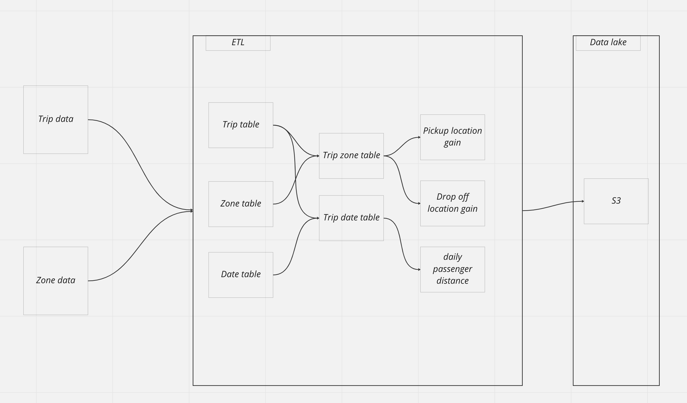

# Udacity data engineering capstone project

## Project purpose
The purpose of this project is to create an ETL pipeline that takes New York city taxi trip, transform the data to different tables and push them to data lakes. The main idea of data partitions are to:

1. Pickup and drop off location for every trip
2. Fare information for each taxi trip
3. Passenger number for each taxi trip parallel with the distance
4. Surchage information for each trip

## Data sources
- [Taxi trip data](https://d37ci6vzurychx.cloudfront.net/trip-data/yellow_tripdata_2019-01.parquet): This dataset is yellow taxi trip in New York in January 2019
- [Zone lookup data](https://d37ci6vzurychx.cloudfront.net/misc/taxi+_zone_lookup.csv): This dataset is zone list of New York city

## Data dictionary

- Trip table
```
 |-- VendorID: long (nullable = true)
 |-- tpep_pickup_datetime: timestamp (nullable = true)
 |-- tpep_dropoff_datetime: timestamp (nullable = true)
 |-- passenger_count: double (nullable = true)
 |-- trip_distance: double (nullable = true)
 |-- RatecodeID: double (nullable = true)
 |-- store_and_fwd_flag: string (nullable = true)
 |-- PULocationID: long (nullable = true)
 |-- DOLocationID: long (nullable = true)
 |-- payment_type: long (nullable = true)
 |-- fare_amount: double (nullable = true)
 |-- extra: double (nullable = true)
 |-- mta_tax: double (nullable = true)
 |-- tip_amount: double (nullable = true)
 |-- tolls_amount: double (nullable = true)
 |-- improvement_surcharge: double (nullable = true)
 |-- total_amount: double (nullable = true)
 |-- congestion_surcharge: double (nullable = true)
 |-- airport_fee: integer (nullable = true)
 |-- uuid: string (nullable = false)
```

- Zone table
```
 |-- LocationID: string (nullable = true)
 |-- Borough: string (nullable = true)
 |-- Zone: string (nullable = true)
 |-- service_zone: string (nullable = true)
```

- Pickup table
```
 |-- uuid: string (nullable = false)
 |-- pick_up_location_id: long (nullable = true)
 |-- drop_off_location_id: long (nullable = true)
 |-- pick_up_borough: string (nullable = true)
 |-- pick_up_zone: string (nullable = true)
```

- Dropoff table
```
 |-- uuid: string (nullable = false)
 |-- pick_up_location_id: long (nullable = true)
 |-- drop_off_location_id: long (nullable = true)
 |-- drop_off_borough: string (nullable = true)
 |-- drop_off_zone: string (nullable = true)
```

- Fare table
```
 |-- uuid: string (nullable = false)
 |-- VendorID: long (nullable = true)
 |-- payment_type: long (nullable = true)
 |-- fare_amount: double (nullable = true)
 |-- extra: double (nullable = true)
 |-- mta_tax: double (nullable = true)
 |-- tip_amount: double (nullable = true)
 |-- total_amount: double (nullable = true)
```

- Passenger table
```
 |-- uuid: string (nullable = false)
 |-- VendorID: long (nullable = true)
 |-- passenger_count: double (nullable = true)
 |-- trip_distance: double (nullable = true)
```

- Surcharge table
```
 |-- uuid: string (nullable = false)
 |-- VendorID: long (nullable = true)
 |-- improvement_surcharge: double (nullable = true)
 |-- congestion_surcharge: double (nullable = true)
```

## ETL pipeline


## Technologies
1. Apache Spark. The reason to choose this is that:
 - High Speed parallel processing
 - Ease of Use
 - Advanced Analytics

2. Amazon S3. The reason for choosing this because:
 - High scalability
 - High Durability
 - High availability

## How to start

1. Config with your aws in `dl.cfg` file

```
KEY=<fill your aws key>
SECRET=<fill your aws secret>
S3=<fill your S3 bucket name>
```

2. Install dependencies

```
pip install -r requirements.txt
```

3. Run the ETL
```
python etl.py
```

## What to be improved
1. Using EMR cluster when processing 100x times of data.
2. Use Apache Airflow to create schedule for running the etl pipeline
3. Use Amazon Redshift if the we want to increase the accessibility (more than 100 people)